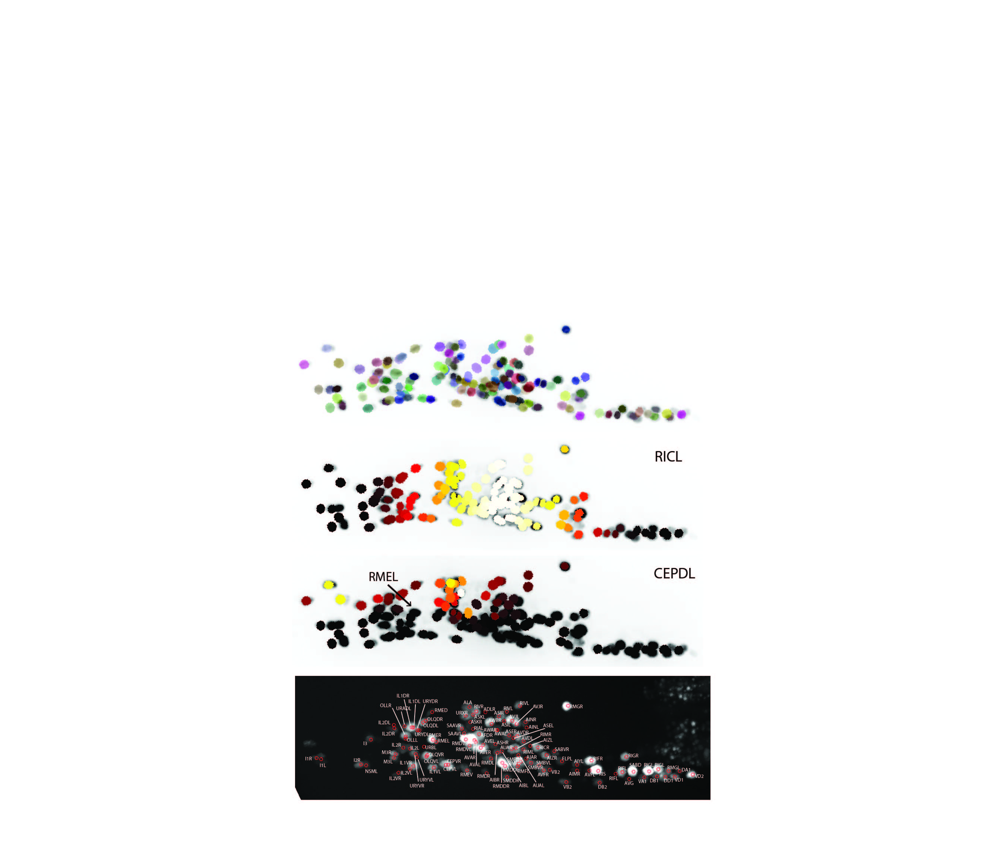

# CRF Cell ID
A stuctured prediction framework for automatically annotating biological identities of cells in brain images.

This repositiry contains - 
* Code for predicting identities in new datasets. The datasets could be gene expression patterns, multi-cell calcium imaging or whole-brain image stacks
* Code for building new atlas based on manually annotated datasets
* Raw datasets used in the paper as well as human annotations</li>

