## News
05/28 - v2 of `CRF_Cell_ID` will be coming out soon with superfast optimization techniques enabling real-time cell annotation!!

# CRF Cell ID
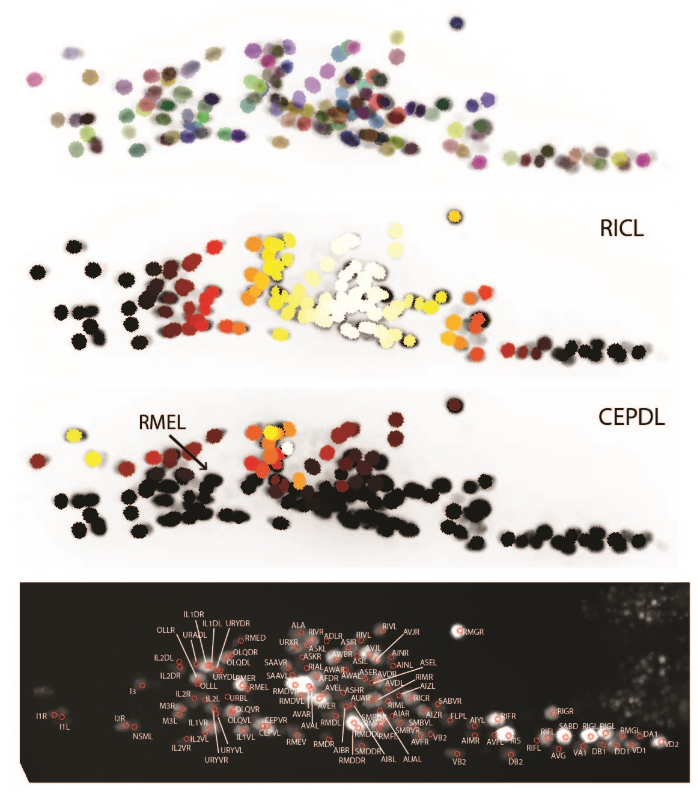

This software/tools were developed for automatically detecting cells in dense brain images, annotating biological identities, visualizing results, and building new atlases using ground-truth annotations. In contrast to popular registration based methods, `CRF_Cell_ID` formulates a structured prediction problem that is solved with second-order Conditional Random Fields model. Thus `CRF_Cell_ID` finds optimal labels for all cells that are most consistent with prior knowledge in terms of maintaining second-order features such as positional relationships. `CRF_Cell_ID` also provides a computationally scalable method for building atlases from thousands of annotated images.

To learn about details of the method, please read the <a href="https://www.biorxiv.org/content/10.1101/2020.03.10.986356v1">paper</a>. A detailed guide on using the framework is __coming soon__

This repository contains - 
1. Code for predicting identities in new datasets
2. Code for building new atlases based on ground-truth annotated datasets
3. Raw datasets used in the paper, ground-truth annotations, and codes for reproducing results

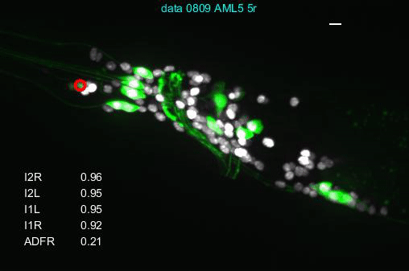

# Contents
1. [Installation](#installation)
2. [Description of repository contents](#description-of-respository-contents)
3. [Step-by-Step Walkthrough](#step-by-step-walkthrough)
   - [Read image data](#1-read-image-data)
   - [Preprocess data for annotation](#2-preprocess-data-for-annotation)
     - [Detecting cells in image channels](#1-detecting-cells-in-image-channels)
     - [Specifying landmarks](#2-specifying-landmarks-in-image-channels)
     - [Selecting axes specifying cells](#3-select-axes-specifying-cells)
     - [Output files](#4-output-files)
   - [Predict identities](#3-predict-identities)
   - [Visualize prediction results](#4-visualize-prediction-results)
4. Building data-driven atlas from annotated data


# Installation
Please make sure to keep the name of the directory as `CRF_Cell_ID` so that walkthrough instructions can be run without changing any paths.
### Installing with Git Shell
```
git clone https://github.com/shiveshc/CRF_Cell_ID.git
```
### Installing online
Click on `Clone or download` button on top right corner and `Download ZIP`

### Dependencies
1. MATLAB 2018b
2. <a href = "https://www.cs.ubc.ca/~schmidtm/Software/UGM.html">UGM Toolbox</a>
3. <a href = "https://sites.google.com/site/myronenko/research/cpd">CPD</a> registration (optional, required only for comparisons)
4. <a href = "https://github.com/Vaa3D">Vaa3D</a> (optional, required only for visualizing ground-truth annotations)

UGM and CPD are provided in the repository so there is no need to download them separately. However please consider citing them.

# Description of respository contents
1. __Main__ : This folder contains the main code for predicting cell identities in new datasets. Includes codes for - 
   - reading image data : `read_tif`
   - preparing data for annotation : `preprocess_data`
   - predicting identities : `annotation_CRF_landmark`
2. __Datasets__ : contains all raw datasets used in the <a href="https://www.biorxiv.org/content/10.1101/2020.03.10.986356v1">paper</a> and their ground-truth annotations.
   - __ComplexOrientations__ : contains 7 datasets of animals imaged with varying rotations along AP axis. `marker_names.xlsx` files in  folders record the names and IDs of manually annotated cells. `markers` file is a Vaa3D marker annotation file that records IDs and positions of all cells. Folder with suffix `_B`, `_C` or `_mN` denote BFP, CyOFP and mNeptune channels
   - __GeneExpressionAnalysis__ : contains 21 datasets of animals used in gene-expression analysis. `.tif` folders contain raw z-planes of 3D stacks acquired in two channels: pan-neuronal RFP and GFP
   - __MultiCellCalciumImaging__ : contains 31 datasets of animals used in multi-cell calcium imaging analysis. `.tif` folders contain raw z-planes of 3D stacks acquired in one channel: GFP
   - __NeuroPAL__ : contains 9 datasets of NeuroPAL animals.`marker_names.xlsx` files in these folders record the names and IDs of manually annotated cells. `markers` file is a Vaa3D marker annotation file that records IDs and positions of all cells in image stack.
3. __utils__ : contains auxillary functions for -
   - reading images and marker files : `read_marker_files`, `readCyOFP_SD`, `readtif_Brucker_for_preprocess_data`
   - detecting cells : `em_segmentation_3d_gpu`, `segment_red_first_half`, `segment_red_second_half`, `remove_close_neurons`
   - preprocessing data : `preprocess_alternate_strain_data`, `preprocess_alternate_strain_data_brucker`, `define_axes_specifying_neurons`
   - registration based prediction : `registration_based_matching_multi`, `registration_based_matching_marker_only`, `registration_based_matching_marker_only_missing_neurons`
   - visualizing intermediate steps and results : `visualize_label_results_marker_only`, `visualize_multi_label_results`, `plot_all_labels_on_img`, `visualize_duplicates_with_scores`, `plot_node_pot`, `plot_edge_pot`
4. __utils_NeuroPAL__ : contains auxillary functions for -
   - reading marker files : `read_marker_files`, `read_marker_files_wo_marker_name`
   - preprocessing data : `preprocess_NeuroPAL_data`, `defining_axes_specifying_neurons`
   - registration based prediction : `registration_based_matching_multi`, `registration_based_matching_2D`
   - comparing absolute position vs relative position variability : `absolute_positions_of_annotated_neurons`, `relative_position_consistency_of_annotated_neurons`
   - building data-driven atlas : `compile_annotated_data`, `color_intensity_distributions`, `update_atlas_based_on_annotation`, `update_atlas_based_on_annotation_with_rotated`
   - visualizing data and prediction : `rgb_img_all_files_in_folder`, `rgb_img_from_indev_channels`, `rgb_img_annotated_data`, `plot_labels_on_rgb_img`
5. __Run_GeneExpression__ : contains codes for predicting cell identities in `GeneExpressionAnalysis` dataset, reproducing prediction comparison results for different methods.
6. __Run_MultiCellCalciumImaging__ : contains codes for predicting cell identities in `MultiCellCalciumImaging` dataset, reproducing prediction comparison results for different methods.
7. __Run_NeuroPAL__ : ccontains codes for predicting cell identities in `NeuroPAL` dataset, reproducing prediction comparison results for different methods. These methods include `Color_Registration`, `CRF`, `CRF_Color`, `CRF_Registration`, and `CRF_Color_Registration`. Additionally registration based matching can be performed using `registration_based_matching_multi` in `utils_NeuroPAL` folder.
8. __Run_SyntheticData__ : contains code for predicting identities in synthetic datasets, analyze the effects of position noise and count noise on accuracy, tuning model, simulating landmark choice and comparison with other methods on synthetic datasets
9. __UGM__ : contains the undirected graphical models library used to formulate and optimize CRF model

# Step-by-Step Walkthrough
Here we provide a detailed step-by-step walkthrough of the framework.

First change current working directory in MATLAB to the cloned `CRF_Cell_ID` folder and add `Main` to path
```
cd '\CRF_Cell_ID' % provide full path of CRF_Cell_ID
addpath('Main')
```

## 1. Read image data
The main function for reading image data is `read_tif` in `Main` folder.
```
Inputs:
 style		'one' if the 3D image stack to be read is saved as one .tif file or 
 		'separate' if individual z-planes are saved as separate images.
 input		image path if style is 'one' e.g. 'CRF_Cell_ID\test_data\img1.tif' or
 		image directory path if style is 'separate' e.g. 'CRF_Cell_ID\test_data\img2'
		
Outputs:
 img		3d image stack variable
```
e.g. we'll read `sample_data1` in `sample_run` folder. Two different channels are present in `sample_data1` as `img1` and `img2`. Each folder contains z-planes saved separately.

```
image1 = read_tif('separate','sample_run\sample_data1\img1');
image2 = read_tif('separate','sample_run\sample_data1\img2');
```
visualizing the max-projection of the two channels, output should look like below
```
figure,imshow(max(mat2gray(image1),[],3),'border','tight')
caxis([0,0.3])
figure,imshow(max(mat2gray(image2),[],3),'border','tight')
caxis([0,0.3])
```
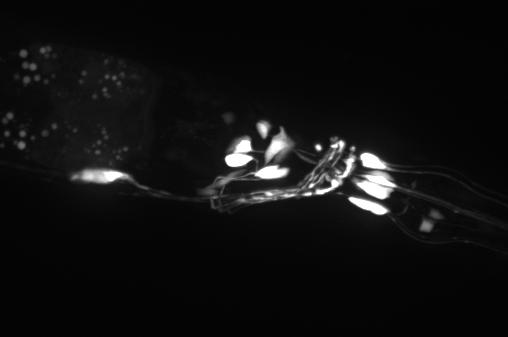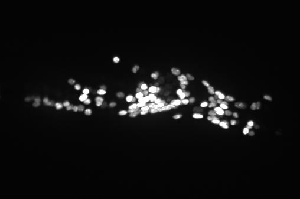

We'll predict identities of cells in the channel on the right and will use the channel on the left as landmark channel i.e. channel in which identities of cells are known. In practice `CRF_Cell_ID` supports any number of landmarks channels as will be shown below. Further, it is not necessary to know the identities of all cells in a landmark channel. Thus `CRF_Cell_ID` easily integrates available information from multiple channels.

## 2. Preprocess data for annotation
In this step we'll 1) detect all cells in each channel read in previous step. 2) specify landmark information 3) generate a coordinate axes in head, and 4) generate a data file that will be used as input in the next step. 

The main script to do this is `preprocess_data` in `Main`
```
Inputs :
 out_folder		directory path where the output data file be saved
 data_name		name of the output data file
 img1			image channel in which identities of cells are to be predicted
 img1_marker		Optional Vaa3d marker file if manually detected cells in img1. If not available set as []
 img1_marker_name	Optional .xlsx file storing the names of manually detected cells in img1. If not available set as []
 varargin		variable number of image channels that can be used as landmark channels. Each varargin is triplet combination of 
 			image, marker file and marker name file e.g. {img,'\img_marker','\img_marker_name.xlsx'} or {img,[],[]} if
			manual detection is not available.

Outputs :
 data file		.mat data file that will be used as input in next step
```

For us, `image2` is the image channel in which cell identities are to be predicted thus our first argument. Further we are not going to use any manual detection of this channel thus arguments 4th (`img1_marker`) and 5th (`img1_marker_name`) are blank. We want to use `image1` as landmark channel but we will provide identities of landmarks on-the-go so we run
```
preprocess_data('sample_run\sample_data1',...
	'data_annotation_sample_data1',...
	image2,...
	[],...
	[],...
	{image1,[],[]})
```
If you don't have any landmark channel, just run
```
preprocess_data('sample_run\sample_data1',...
	'data_annotation_sample_data1',...
	image2,...
	[],...
	[])
```
### 1. Detecting cells in image channels
The output on terminal should look like
```
Segmenting main image channel ... 
Enter thresh_parameter value between 0-100. Higher values for detecting few but brightest cells - 
```

Here the `thresh_parameter` is an input parameter for segmenting cells which is used to initialize the means of gaussian mixture components. We'll start with trying 99.95 as the value. This will generate an output image showing detected cells

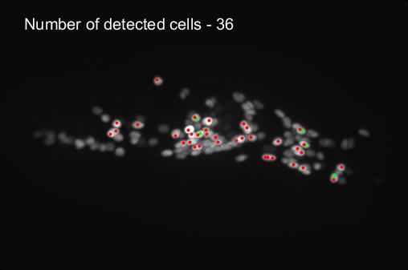

Clearly the parameeter value is too high as many cells are not detected thus we'd like to specify the parameter value again. On the terminal you shoud see the message asking to accept/reject the current parameter value

```
Enter thresh_parameter value between 0-100. Higher values for detecting few but brightest cells - 99.95
Enter 'y' if accept thresh_parameter else enter 'n' -
```

We'll enter 'n' becuase we are not satisfied with the chosen `thresh_parameter` and lower the value to detect more cells. After a couple of trial and errors we select 99.83 as the parameter value. In this case, the image should look like

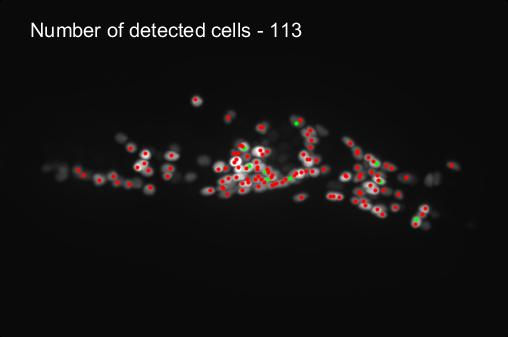

Since we're satisfied with this parameter, we'll enter 'y' on terminal this time. Now the GM model will be fitted to image data to segment cells. The terminal should look like
```
Enter 'y' if accept thresh_parameter else enter 'n' - 'y'

ans =

      228643           3


ans =

    'iter:1, likelihood:-12.5171, error:0.34564'


ans =

    'iter:2, likelihood:-12.5379, error:0.32442'


ans =

    'iter:3, likelihood:-12.5495, error:0.31976'


ans =

    'iter:4, likelihood:-12.5559, error:0.3181'


ans =

    'iter:5, likelihood:-12.5598, error:0.31733'
```
Next the same process will be repeated for all landmark channels. In this case, the output should look like
```
Segmenting image channel 2
Enter thresh_parameter value between 0-100. Higher values for detecting few but brightest cells - 99.98
Enter 'y' if accept thresh_parameter else enter 'n' - 'n'
Enter thresh_parameter value between 0-100. Higher values for detecting few but brightest cells - 99.97
```
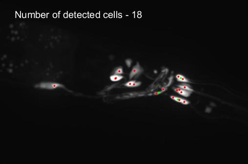

```
Enter 'y' if accept thresh_parameter else enter 'n' - 'y'

ans =

       36865           3


ans =

    'iter:1, likelihood:-10.4939, error:0.37325'


ans =

    'iter:2, likelihood:-10.4993, error:0.36659'


ans =

    'iter:3, likelihood:-10.5018, error:0.36522'


ans =

    'iter:4, likelihood:-10.5028, error:0.36471'
```

**_Skipping cell detection in specific channels (optional)_**

Note that automatic cell segmentation step can be skipped for any image channel if automatic segmentation does not generate good results and manual detections for the channel are available such as marker annotation files generated with Vaa3D. e.g. instead of automatic detetction for `image1` we can use `img1_markers` and `img1_marker_names.xlsx` in `sample_data_1`. In this case, we run `precprocess_data` as follows

```
preprocess_data('sample_run\sample_data1',...
	'data_annotation_sample_data1',...
	image2,...
	[],...
	[],...
	{image1,'sample_run\sample_data1\img1_markers','sample_run\sample_data1\img1_marker_names.xlsx'})
```
In the above, automatic segmentation will be performed only for `image2` and not for `image1`. Please take a look at `img1_markers` and `img1_marker_names.xlsx` files to see their formats.

### 2. Specifying landmarks in image channels
Next, we'll specify landmark information in channels by going through each landmark channel one-by-one, selecting landmark cell in each channel (via user input) and entering the selected cell's name in terminal. A terminal prompt will ask for which image channels to use for specifying landmarks

```
Enter which channels to use for specifying landmarks e.g [2,4] else enter blank (as single quotes) -
```

We'll use `image1` channel to specify identities of easily identified cells in whole-brain stack as well as the landmark channel i.e `image2`, thus, enter [1,2]. Note, here 1 always denotes the `img1` argument and channel 2 onwards denote images provided in `varargin`. If you do not want to specify landmarks in any channel, enter `[]`

```
Enter which channels to use for specifying landmarks e.g [2,4] else enter blank (as single quotes) - [1,2]
```

In this case we'll first see `image2` for selecting landmarks. With the cursors on the image, users can click on any cell whose identity they want to specify. We also get the following prompt on the terminal

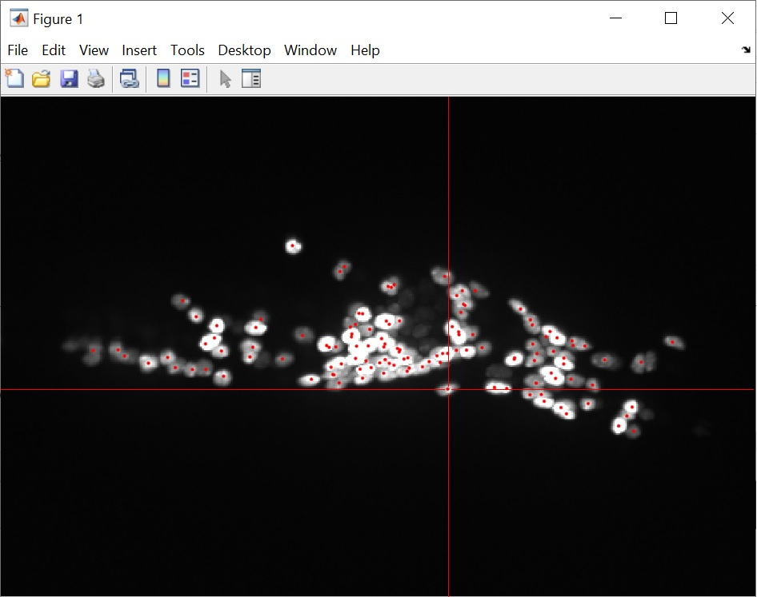 

```
Enter name of the selected landmark e.g. 'RMEL' -
```

After clicking on desired cell in the image e.g. the one highlighted in image above, we enter its name on the terminal 'RMEV'.

```
Enter name of the selected landmark e.g. 'RMEL' - 'RMEV'
```

Next we get the follwoing prompt
```
If done with this channel, enter 'y' -
```
We'll enter 'n' since we want to select more landmark cells. When done, we'll enter 'y'. Thus, following the prompts on the terminal, users can easily specify identities of as many landmarks as they want e.g.

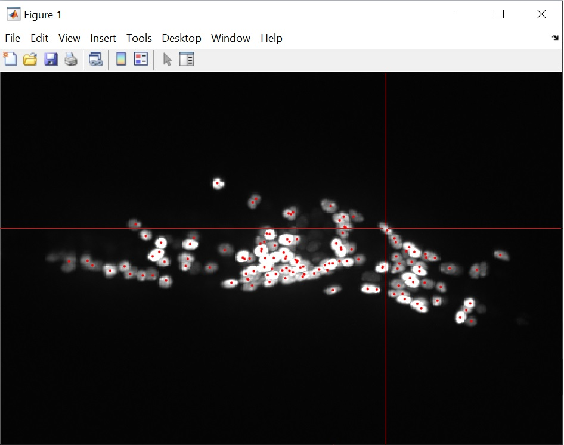

```
Enter name of the selected landmark e.g. 'RMEL' -'RMED'
If done with this channel, enter 'y' - 'y'
```

Next, the same process will be performed one-by-one for each landmark channel specified above, `[1,2]` in our case. Thus we specify landmarks in `image1` next.

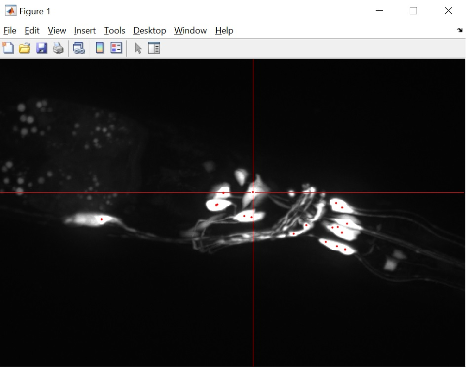

```
Enter name of the selected landmark e.g. 'RMEL' - 'ASGL'
If done with this channel, enter 'y' - 'n'

```

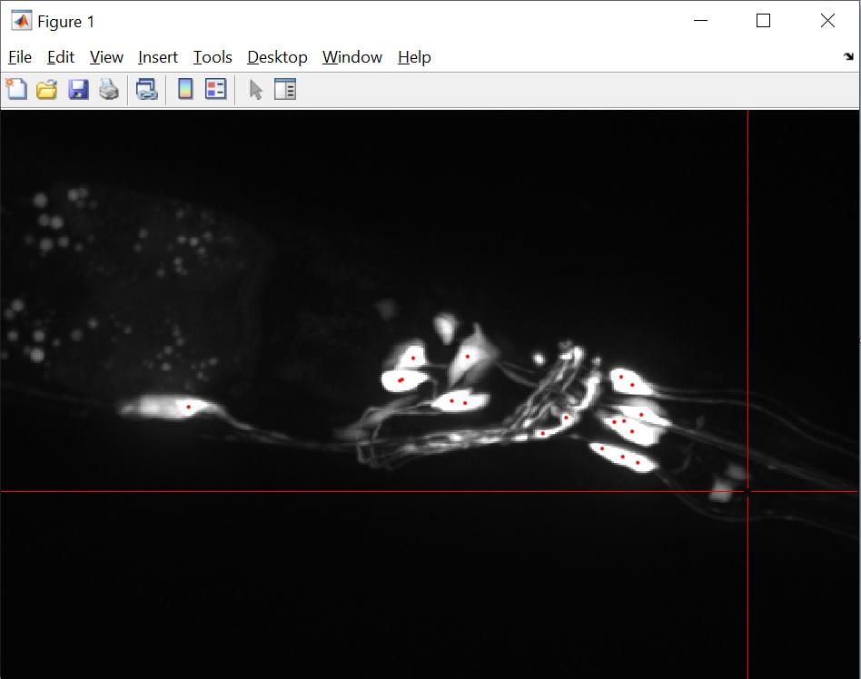

```
Enter name of the selected landmark e.g. 'RMEL' - 'AIBR'
If done with this channel, enter 'y' - 'y'
```
`CRF_Cell_ID` **_automatically compiles landmark names saved in marker_name files_**

Note, along with the landmark cells specified by users as above, cell names that may be present in marker_name.xlsx files are automatically added to the list of landmark cells. e.g. if we ran
```
preprocess_data('sample_run\sample_data1',...
	'data_annotation_sample_data1',...
	image2,...
	[],...
	[],...
	{image1,'sample_run\sample_data1\img1_markers','sample_run\sample_data1\img1_marker_names.xlsx'})
```
then, the manually annotated names of cells present in `img1_marker_names.xlsx` are automatically added to the list of landmark cells. If the `img1_marker_names.xlsx` is empty then no names are added.

### 3. Select axes specifying cells
Next, we'll select axes specifying cells via user input. These cells enable defining a consistent coordinate system in head which is crucical for accurately extracting features from image. To do so, the terminal prompt asks to sequentially click on cells in the image.

First, we will click on two cells in the image, one in the anterior and one in the posterior region of the head. These cells will be used to define the anterior-posterior (AP) axis. Here, users can click on any cell; the specific identity of selected cell doesn't matter as these cells are used only to check the consistency of axis direction. First, we click on a cell that in the anterior of the head ganglion in the image
```
ans =

    'select (A)-P neuron. If not present than right click.'
```
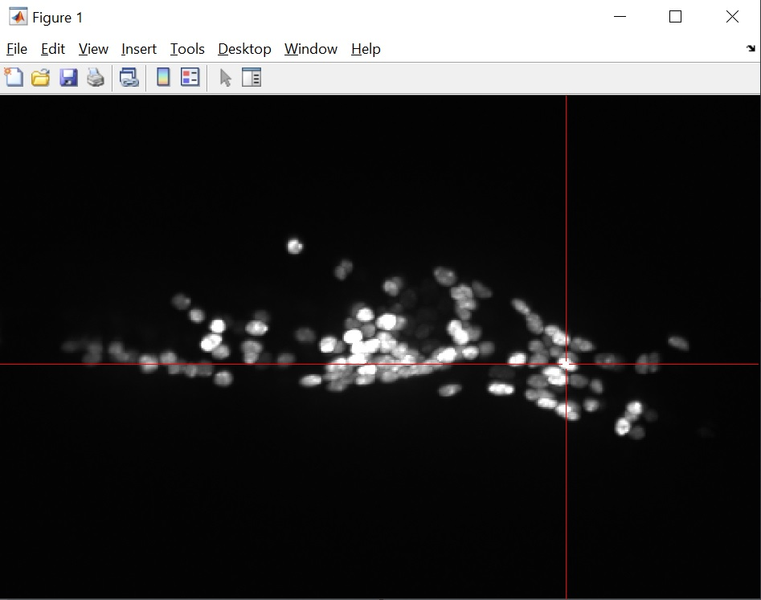

Next, we click on any cell in the posterior of the head ganglion. Again, any cell can be clicked on as long as it is posterior to the cell selected in anterior region in previous step.
```
ans =

    'select A-(P) neuron. If not present than right click.'
```
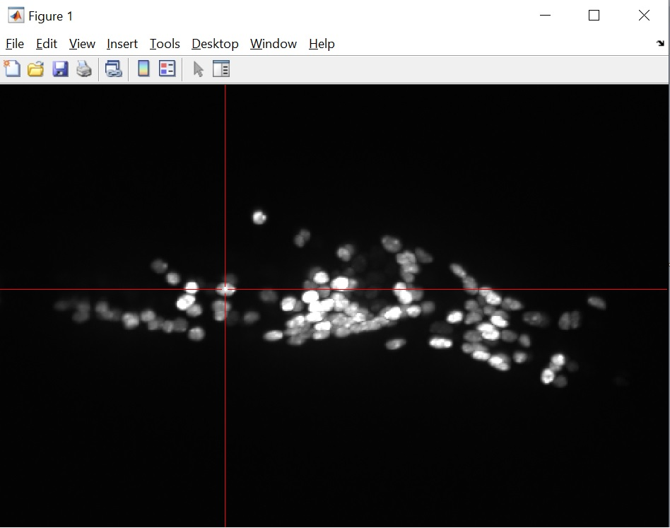

Next, we will click on two cells that will help in defining the left-right (LR) axis. Since distinguishing between cells in the left and right region of head in current view of the image is difficult, we'll skip selecting cells by right-clicking anywhere in the image
```
ans =

    'select (L)-R neuron. If not present than right click.'


ans =

    'select L-(R) neuron. If not present than right click.'
```
Lastly, we will click on two cells that will help in defining the dorsal-ventral (DV) axis.
```
ans =

    'select (D)-V neuron. If not present than right click.'
```

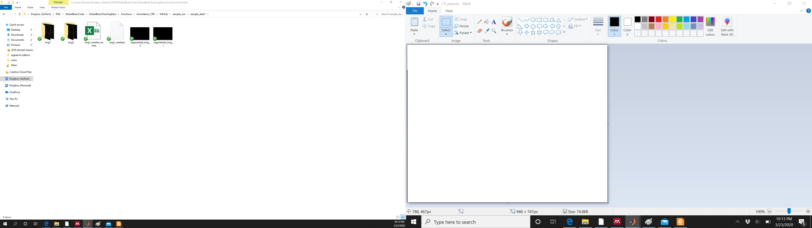

```
ans =

    'select D-(V) neuron. If not present than right click.'
```

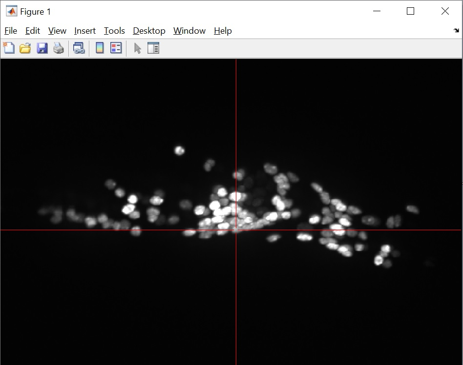

After selecting all axes specifying cells we get the following prompt on the terminal.
```
Enter PCA coefficients for specifying AP, LR and DV axes e.g [1,2,3] or [1,3,2] -
```
`CRF_Cell_ID` automatically generates AP, LR, and DV axes by PCA on cell postions. However we need to specify the correspondence between PCA eigenvectors and axes e.g [1,2,3] means PCA eignevectors 1, 2, and 3 correspond to AP, LR and DV axes respectively. Most of the time, eigenvectors corresponding to LR and DV axes flip thus either [1,2,3] or [1,3,2] input values work most of the times. We enter [1,3,2]

```
Enter PCA coefficients for specifying AP, LR and DV axes e.g [1,2,3] or [1,3,2] - [1,3,2]
```
This should generate an image showing cells detected in image (red dots) and automatically generated PA (blue), LR (green) and DV (black) axes. Sample views are shown below

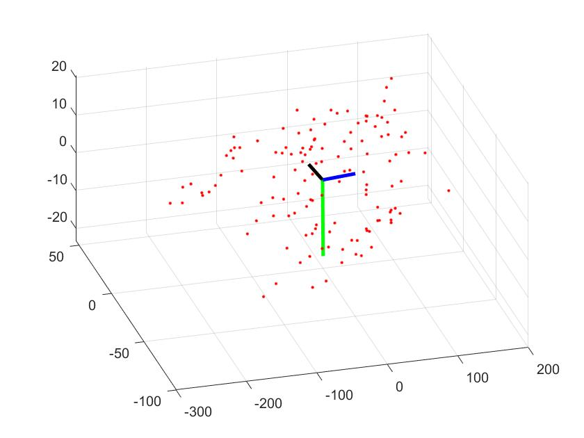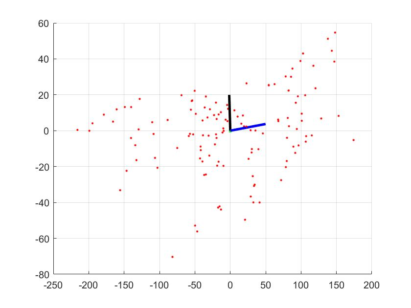
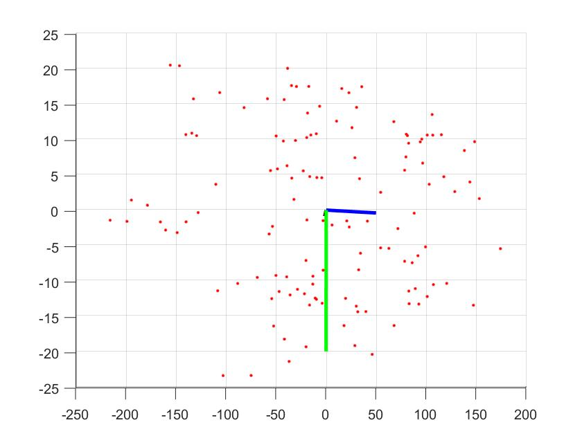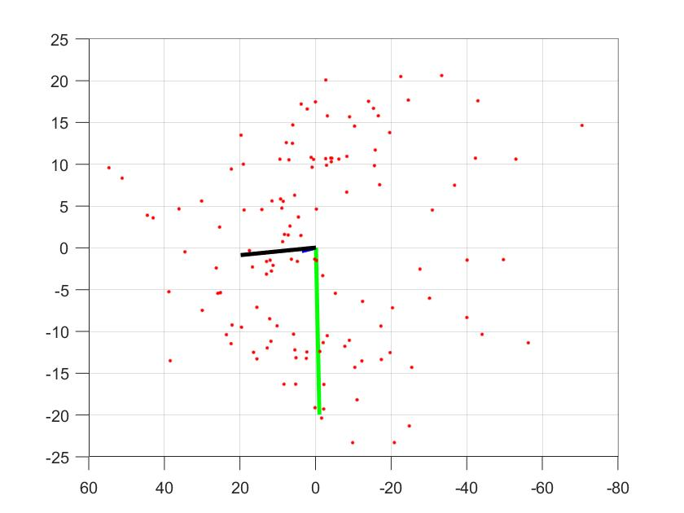

### 4. Output files
Finally we should see a message on the terminal
```
Preprocessing finished
```
Three output files are saved in the `output_folder` argument that we provided while running `preprocess_data`
| File Name | Description |
| --- | --- |
| `data_annotation_sample_data1.mat` | File saving all relevant information that will be used in next step |
| `segmented_img_r.tif` | segmented stack of the `img1` image channel. example segmentation and visualization in Vaa3D is shown below|
| `segmented_img_2.tif` | segmented stack of the first landmark image channel (channel corresponding to `image1` for us ) provided as input in `varargin`. segmented stacks of subsequent stacks are saved as well|


Now let's look at the variables stored in the file `data_annotation_sample_data1.mat`. If we load the file in matlab using
```
load('sample_run\sample_data1\data_annotation_sample_data1.mat')
```
we get following variables in matlab workspace.

```
axes_neurons_to_neuron_map		a 6-by-1 vector map specifying the indices of the cells in the segmented main image channel that we 
					selected for specifying anterior (A), posterior (P), left (L), right (R), dorsal (D) and ventral
					(V) axis in the previous section
axes_param				axes parameter specified in previous section
cmap					color useful to visualize cell segmentations in image channel
img_1					3D img stack for the main image channel in which cell identities are to be annotated
ind_PCA					an internal parameter that tells that PCA is to be used for specifyig AP, LR and DV axes
labeled_img_other_channels		a 1-by-n cell array storing segmentations of n landmark channels provided in preprocess_data command
labeled_img_r				3D segmented stack of main channel in which cell identities are to be annotated
landmark_names				n-by-1 cell array specifying names of all landmarks provided by user input or read from files provided
					in preprocess_data command
landmark_to_neuron_map			n-by-1 vector specifying the indices of cells in the segmented main channel corresponding to landmarks
					we selected manually and named or provided
mu_c					n-by-3 matrix storing the center coordinates of landmarks in all landmark channels that we manually named
					or provided
mu_other_channels			a 1-by-n cell array storing center coordinates of all cells segmented in n landmark channels
mu_r					k-by-3 matrix storing the center coordinates of all cells segmented in main channel. These segmented cells
					identities will be automatically annotated
specify_PA				an internal parameter that tells that 1st PC is to be used for specifyig AP
varargin				3D img stack of all landmark channels provided as input in preprocess_data command
```

You can use these variables for a lot of useful tasks. e.g. if you wish to visualize how the segmentation of the `image2` looks, simply run
```
figure, imshow(max(labeled_img_r, [], 3), cmap, 'border', 'tight')
```
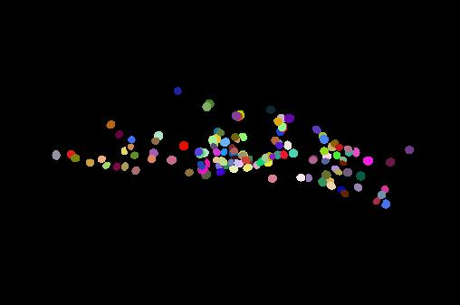

Similary segmentations of landmark channels can visualized as well using `labeled_img_other_channels` variable. For another task, if you want to visualize how all
landmark cells (that we manually provided names for in landmark channels or supplied in `preprocess_data` command) map to the main image, run following commands
```
figure, imshow(max(img_1, [], 3), [], 'border', 'tight')
hold on
for n = 1:size(landmark_to_neuron_map, 1)
	scatter(mu_r(landmark_to_neuron_map(n, 1), 1), mu_r(landmark_to_neuron_map(n, 1), 2), '.r')
	text(mu_r(landmark_to_neuron_map(n, 1), 1) + 3, mu_r(landmark_to_neuron_map(n, 1), 2) + 3, landmark_names{n, 1}, 'Color', 'w')
end
```


`CRF_Cell_ID` annotates the identities of all cells keeping the landmark cells' identities fixed and constraining the optimization.

## 3. Predict identities
Once done with reading and preparing data for annotation, we'll run the core prediction algorithm. The main function to do is `annotation_CRF_landmark`

```
Inputs :
 strain			strain type for which predicting identities. valid values are 'LandmarkStrain' if predicting identities
 			in landmark strain described in the paper or 'other' 
 data			location path of the preprocessed data file generate by preprocess_data.m in previous step
 out_file		location path where the results will be saved
 node_pot_type		how to calculate node potentials. valid inputs are -
 			'uniform' - equal probability of each cell taking each label
			'ap' - based on position of cells along the anterior-posterior axis
			'reg' - affinities based on registration based matching with the atlas
			'col' - based on proximity of color in image to color in atlas
 numLabelRemove		number of cells missing in the image, required to account for missing cells while predicting.
 			requires multiple runs thus useful if running on cluster else set to 0
 varargin		named-value pair arguments that include - 
 			'weights' - 1-by-5 array specifying weights of features in model e.g [1,1,1,1,1] for PA, LR, DV, proximity
			angular relationship feature

Outputs :
 results file		output file that stored predicted identities
```

To do so we run

```
annotation_CRF_landmark('other',...
	'sample_run\sample_data1\data_annotation_sample_data1',...
	'sample_run\sample_data1\results_annotation_sample_data1',...
	'ap',...
	0)
```

Or say we want to annotate identities using only PA, LR, DV and angular relationship features, i.e. weight of only these features should be set to 1 and weights of all other features should be set to zero, we run
```
annotation_CRF_landmark('other',...
	'sample_run\sample_data1\data_annotation_sample_data1',...
	'sample_run\sample_data1\results_annotation_sample_data1',...
	'ap',...
	0,...
	'weights',[1,1,1,0,1])
```
We get the following output in terminal.

```
1. Created axes
2. Created node potentials
3. Created edge potentials
4. Starting optimization
5. Resolving duplicates and re-running optimization
6. Saving prediction
```

An output file is saved in the `out_file` path. Let's take a look at the contents of this file. Load the file in matlab using

```
load('sample_run\sample_data1\results_annotation_sample_data1.mat')
```

In the file a struct (structured matlab object) named `experiments` is saved. This object stores metadata of parameters used for optimization and final assigned identities to cells. Two most important variables for us for visualizing predictions are

```
node_label		k-by-1 array where k is the number of cells segmented in main image channel. Each entry in this 
			vector corresponds to the index of cell in atlas whose name is assigned to current cell in data.
Neuron_head		list of names of all neurons in atlas. These labels/names were candidate labels for each cell.
```

## 4. Visualize prediction results
To visualize prediction results, use function `visualize_annotation_output` in `Main` as below. First load the dataset generated as output of `preprocess_data` function. This dataset stores the main channel image stack `img_1`, and segmented cell postions `mu_r`. Next, load annotation prediction results i.e. the output of `annotation_CRF_landmark` function.

```
load('sample_run\sample_data1\data_annotation_sample_data1.mat')
load('sample_run\sample_data1\data_annotation_sample_data1.mat')
```

Then, to visualize ith cell's prediction, run the following snippet e.g. when i = 16

```
visualize_annotation_output(img_1, mu_r, experiments(1).node_label(:, 1), experiments(1).Neuron_head, 16)
```
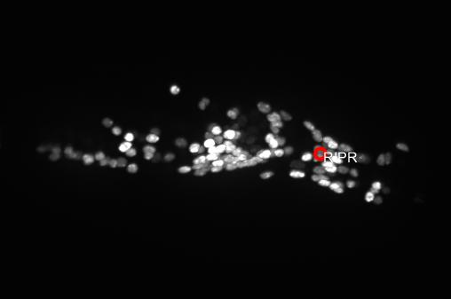

Some more individial cell prediction results are shown below.
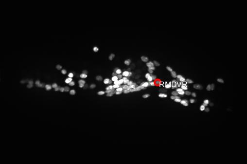
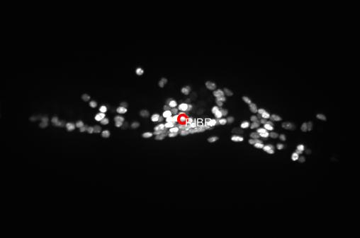
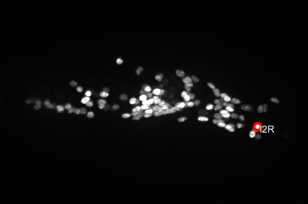

To visualize all cells' prediction simultaneously, use the following snippet

```
visualize_annotation_output(img_1, mu_r, experiments(1).node_label(:, 1), experiments(1).Neuron_head, [])
```
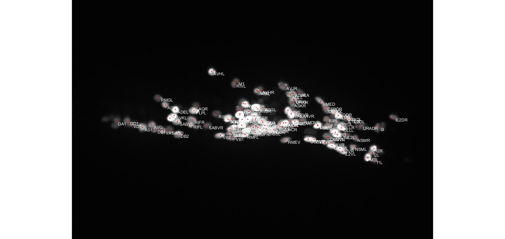


	
	
	
  

  
